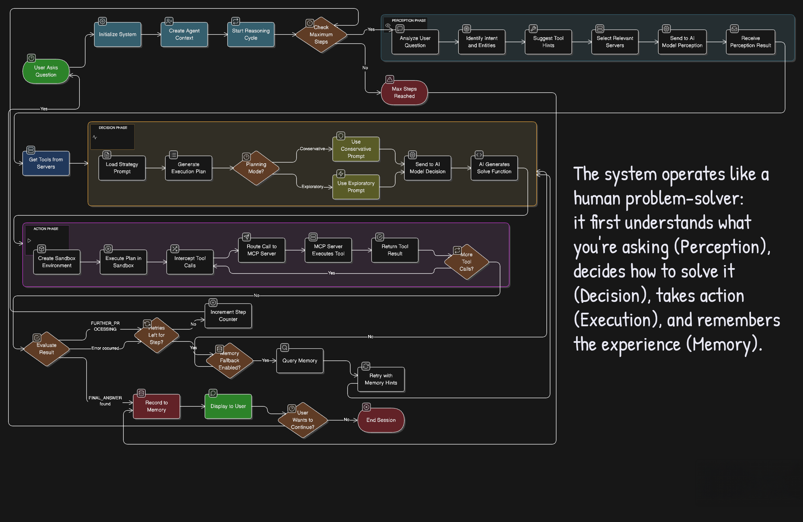

# Cortex-R AI Agent - Architecture Documentation for Stakeholders

## Executive Summary

Cortex-R is an intelligent AI agent system that helps users solve complex problems by breaking them down into smaller, manageable steps. Think of it as a smart assistant that can understand your question, figure out what tools it needs to answer it, create a plan, execute that plan, and remember what it did for future reference.

The system operates like a human problem-solver: it first understands what you're asking (Perception), decides how to solve it (Decision), takes action (Execution), and remembers the experience (Memory).

---

## System Architecture Diagram

### Overall System Architecture

<div align="center">
  
  <p><em>Figure 1. Cortex-R architecture overview (2375 × 1544)</em></p>
</div>

```
┌─────────────────────────────────────────────────────────────────────┐
│                         CORTEX-R AI AGENT                           │
└─────────────────────────────────────────────────────────────────────┘

┌─────────────────────────────────────────────────────────────────────┐
│                         USER INTERFACE                              │
│                                                                     │
│  agent.py: Command-line interface                                  │
│  - Accepts user questions                                           │
│  - Displays step-by-step progress                                   │
│  - Shows final answers                                              │
└─────────────────────────────────────────────────────────────────────┘
                                 │
                                 ▼
┌─────────────────────────────────────────────────────────────────────┐
│                      ORCHESTRATION LAYER                            │
│                                                                     │
│  core/loop.py: AgentLoop                                            │
│  - Manages Perception → Decision → Action cycle                     │
│  - Enforces step limits and retries                                 │
│  - Determines when to continue or finish                            │
└─────────────────────────────────────────────────────────────────────┘
                                 │
                 ┌───────────────┼───────────────┐
                 ▼               ▼               ▼
┌──────────────────┐  ┌──────────────────┐  ┌──────────────────┐
│   PERCEPTION     │  │    DECISION      │  │     ACTION       │
│                  │  │                  │  │                  │
│ modules/         │  │ modules/         │  │ modules/         │
│ perception.py    │  │ decision.py      │  │ action.py        │
│                  │  │                  │  │                  │
│ • Understands    │  │ • Creates plan   │  │ • Executes plan  │
│   user intent    │  │ • Selects tools  │  │ • Calls tools    │
│ • Selects        │  │ • Generates      │  │ • Returns        │
│   servers        │  │   solve() code   │  │   results        │
└──────────────────┘  └──────────────────┘  └──────────────────┘
         │                     │                      │
         └──────────┬──────────┴──────────┬──────────┘
                    ▼                     ▼
         ┌──────────────────┐  ┌──────────────────┐
         │  MODEL MANAGER   │  │ SESSION MANAGER  │
         │                  │  │                  │
         │ modules/         │  │ core/session.py  │
         │ model_manager.py │  │                  │
         │                  │  │ • MultiMCP       │
         │ • Connects to    │  │ • Routes tool    │
         │   AI models      │  │   calls          │
         │ • Sends prompts  │  │ • Manages        │
         │ • Gets responses │  │   servers        │
         └──────────────────┘  └──────────────────┘
                    │                     │
                    ▼                     └────────┬────────┬────────┐
         ┌──────────────────┐                     ▼        ▼        ▼
         │   AI MODELS      │              ┌─────────┐ ┌────────┐ ┌──────┐
         │                  │              │ MCP     │ │ MCP    │ │ MCP  │
         │ • Google Gemini  │              │ Server1 │ │Server2 │ │Server│
         │ • Ollama (local) │              │ (Math)  │ │ (Docs) │ │(Web) │
         └──────────────────┘              └─────────┘ └────────┘ └──────┘

┌─────────────────────────────────────────────────────────────────────┐
│                      SUPPORT SYSTEMS                                │
├─────────────────────────────────────────────────────────────────────┤
│  Memory Manager (modules/memory.py)                                 │
│  - Records all interactions                                         │
│  - Stores tool calls and results                                    │
│  - Enables learning from past experiences                           │
│  → Writes to: memory/YYYY/MM/DD/session-*.json                      │
├─────────────────────────────────────────────────────────────────────┤
│  Context Manager (core/context.py)                                  │
│  - Maintains session state                                          │
│  - Tracks current step and progress                                 │
│  - Loads configuration                                              │
├─────────────────────────────────────────────────────────────────────┤
│  Strategy Selector (core/strategy.py)                               │
│  - Chooses conservative vs exploratory mode                         │
│  - Enables memory fallback                                          │
│  - Filters tools based on hints                                     │
└─────────────────────────────────────────────────────────────────────┘

┌─────────────────────────────────────────────────────────────────────┐
│                     CONFIGURATION FILES                             │
├─────────────────────────────────────────────────────────────────────┤
│  config/profiles.yaml                                               │
│  - Agent behavior settings                                          │
│  - Strategy configuration                                           │
│  - Tool server definitions                                          │
│  - Memory settings                                                  │
├─────────────────────────────────────────────────────────────────────┤
│  config/models.json                                                 │
│  - AI model definitions                                             │
│  - API endpoints and keys                                           │
│  - Model selection                                                  │
├─────────────────────────────────────────────────────────────────────┤
│  prompts/*.txt                                                      │
│  - Perception prompt template                                       │
│  - Decision prompt templates (conservative, exploratory)            │
└─────────────────────────────────────────────────────────────────────┘

┌─────────────────────────────────────────────────────────────────────┐
│                        DATA STORAGE                                 │
├─────────────────────────────────────────────────────────────────────┤
│  documents/                                                         │
│  - Source documents (PDFs, DOCX, etc.)                              │
│  - Web page archives                                                │
│  - Knowledge base content                                           │
├─────────────────────────────────────────────────────────────────────┤
│  faiss_index/                                                       │
│  - index.bin: Vector embeddings of document chunks                  │
│  - metadata.json: Document metadata                                 │
│  - doc_index_cache.json: Processing cache                           │
├─────────────────────────────────────────────────────────────────────┤
│  memory/                                                            │
│  - YYYY/MM/DD/session-*.json: Session recordings                    │
│  - Organized by date for easy access                                │
└─────────────────────────────────────────────────────────────────────┘
```

### Detailed Flow Diagram

```
USER ASKS QUESTION
      │
      ▼
┌─────────────────────────────────────┐
│  agent.py creates AgentContext      │
│  - Loads configuration               │
│  - Initializes MCP servers          │
│  - Creates memory session           │
└─────────────────────────────────────┘
      │
      ▼
┌─────────────────────────────────────┐
│  AgentLoop starts (core/loop.py)    │
│  Step 1 of max_steps                │
└─────────────────────────────────────┘
      │
      ▼
┌─────────────────────────────────────┐
│  PHASE 1: PERCEPTION                │
│  (modules/perception.py)            │
│                                     │
│  1. Send user question + server     │
│     descriptions to AI model        │
│  2. AI analyzes and returns:        │
│     • Intent                        │
│     • Entities                      │
│     • Tool hints                    │
│     • Selected servers              │
└─────────────────────────────────────┘
      │
      ▼
┌─────────────────────────────────────┐
│  Get tools from selected servers    │
│  (core/session.py)                  │
└─────────────────────────────────────┘
      │
      ▼
┌─────────────────────────────────────┐
│  PHASE 2: DECISION                  │
│  (modules/decision.py)              │
│                                     │
│  1. Load decision prompt based on   │
│     strategy (conservative/         │
│     exploratory)                    │
│  2. Send to AI model:               │
│     • User question                 │
│     • Perception result             │
│     • Available tool descriptions   │
│  3. AI generates solve() function   │
│     with tool calls                 │
└─────────────────────────────────────┘
      │
      ▼
┌─────────────────────────────────────┐
│  PHASE 3: ACTION                    │
│  (modules/action.py)                │
│                                     │
│  1. Create sandboxed environment    │
│  2. Execute solve() function        │
│  3. Intercept tool calls            │
│  4. Route to Session Manager        │
└─────────────────────────────────────┘
      │
      ▼
┌─────────────────────────────────────┐
│  Session Manager routes calls       │
│  (core/session.py)                  │
│                                     │
│  For each tool call:                │
│  1. Find which server has the tool  │
│  2. Connect to that MCP server      │
│  3. Call the tool                   │
│  4. Return result                   │
└─────────────────────────────────────┘
      │
      ▼
┌─────────────────────────────────────┐
│  Check result:                      │
│  • FINAL_ANSWER → Done!             │
│  • FURTHER_PROCESSING → Continue    │
│  • Error → Retry or next step       │
└─────────────────────────────────────┘
      │
      ├─────────────────────────────────┐
      │                                 │
      ▼                                 ▼
   ┌──────┐                     ┌──────────────┐
   │ Done │                     │ Retry or     │
   │      │                     │ Next Step    │
   │      │                     └──────────────┘
   │      │                            │
   │      │                            ▼
   │      │                     ┌──────────────┐
   │      │                     │ Back to      │
   │      │                     │ Phase 1      │
   │      │                     └──────────────┘
   └──────┘
      │
      ▼
┌─────────────────────────────────────┐
│  Record to Memory                   │
│  (modules/memory.py)                │
│                                     │
│  • User question                    │
│  • All tool calls                   │
│  • Tool results                     │
│  • Success/failure                  │
│  • Final answer                     │
│                                     │
│  → Save to memory/                  │
│     YYYY/MM/DD/session-*.json       │
└─────────────────────────────────────┘
      │
      ▼
┌─────────────────────────────────────┐
│  Display to User                    │
│  (agent.py)                         │
│                                     │
│  💡 Final Answer: [result]          │
└─────────────────────────────────────┘
```

---

## Table of Contents

1. [High-Level System Overview](#high-level-system-overview)
2. [Core Components](#core-components)
3. [How the System Works: The Main Flow](#how-the-system-works-the-main-flow)
4. [Detailed Component Descriptions](#detailed-component-descriptions)
5. [Tool Servers: The Agent's Capabilities](#tool-servers-the-agents-capabilities)
6. [Data Flow and Interactions](#data-flow-and-interactions)
7. [Configuration and Customization](#configuration-and-customization)
8. [Memory and Learning](#memory-and-learning)
9. [System Architecture Diagram](#system-architecture-diagram)

---

## High-Level System Overview

### What is Cortex-R?

Cortex-R is an AI reasoning agent that can:
- Understand complex questions in natural language
- Break down problems into smaller steps
- Use specialized tools to gather information or perform calculations
- Search through stored documents
- Look up information on the internet
- Remember past interactions to improve future responses
- Explain its reasoning process step by step

### Who Uses It?

- **End Users**: People who need answers to complex questions or help with multi-step tasks
- **Developers**: Engineers who want to customize the agent's behavior or add new capabilities
- **Business Analysts**: Stakeholders who need to understand what the system can do

### Key Characteristics

1. **Reasoning-Driven**: The agent doesn't just respond—it thinks through problems step by step
2. **Tool-Enabled**: Can use external tools for math, document search, web search, and more
3. **Memory-Persistent**: Remembers previous conversations and learns from them
4. **Configurable**: Behavior can be adjusted without changing code
5. **Transparent**: Shows its thought process at each step

---

## Core Components

The system is built from several key components that work together:

### 1. The Main Agent (agent.py)
**What it does**: This is the entry point—the "front desk" of the system. It greets the user, accepts questions, coordinates all other components, and displays results.

**Business analogy**: Like a receptionist who takes your request, routes it to the right departments, and brings back the answer.

### 2. The Agent Loop (core/loop.py)
**What it does**: This is the "brain" that orchestrates the three-phase cycle: Understand → Plan → Act. It keeps repeating these phases until the problem is solved.

**Business analogy**: Like a project manager who breaks a project into phases, executes each phase, and checks if the goal is achieved before moving to the next phase.

### 3. Perception Module (modules/perception.py)
**What it does**: Analyzes the user's question to understand what they're really asking for and which tools might be needed.

**Business analogy**: Like a customer service representative who listens to your problem and determines which department can help you best.

### 4. Decision Module (modules/decision.py)
**What it does**: Creates a detailed plan (a step-by-step recipe) for solving the problem using available tools.

**Business analogy**: Like a consultant who, after understanding your problem, writes out a detailed action plan with specific tasks.

### 5. Action Module (modules/action.py)
**What it does**: Executes the plan safely in a controlled environment, calling the necessary tools and gathering results.

**Business analogy**: Like a task execution team that follows the consultant's plan, performs each action, and reports back the results.

### 6. Memory Manager (modules/memory.py)
**What it does**: Records every interaction, tool usage, and result so the agent can learn from past experiences.

**Business analogy**: Like a corporate knowledge base that stores all past projects, decisions, and outcomes for future reference.

### 7. Session Manager (core/session.py)
**What it does**: Manages connections to different tool servers and routes tool requests to the right server.

**Business analogy**: Like a switchboard operator who connects your call to the right department based on your needs.

### 8. Model Manager (modules/model_manager.py)
**What it does**: Handles communication with AI language models (like Google's Gemini) that power the agent's intelligence.

**Business analogy**: Like the IT department that manages access to the company's AI infrastructure.

---

## How the System Works: The Main Flow

### The Three-Phase Cycle

When you ask the agent a question, it goes through a repeating cycle until it finds the answer:

```
User Question → Perception → Decision → Action → Answer (or repeat)
```

Let's walk through an example: **"What is the sum of ASCII values of the word HELLO?"**

#### Phase 1: Perception (Understanding)
**What happens**: The agent analyzes your question to understand:
- **Intent**: "Calculate sum of ASCII values"
- **Entities**: "HELLO" (the word to process)
- **Required Tools**: String-to-ASCII converter, addition function
- **Which Tool Server**: Math server

**Output**: A structured understanding of what you want, stored as:
```
Intent: Convert string to ASCII and sum
Entities: ["HELLO"]
Tool Hint: strings_to_chars_to_int, add
Selected Servers: ["math"]
```

#### Phase 2: Decision (Planning)
**What happens**: The agent creates a step-by-step plan in the form of executable code:

```python
async def solve():
    # Step 1: Convert "HELLO" to ASCII values
    input = {"string": "HELLO"}
    ascii_values = await mcp.call_tool('strings_to_chars_to_int', input)
    # Result: [72, 69, 76, 76, 79]

    # Step 2: Sum the values
    total = sum(ascii_values)

    return f"FINAL_ANSWER: The sum is {total}"
```

**Output**: An executable plan that the action module can run.

#### Phase 3: Action (Execution)
**What happens**: The agent runs the plan in a safe environment:
1. Calls the `strings_to_chars_to_int` tool with "HELLO"
2. Receives [72, 69, 76, 76, 79]
3. Sums them: 72 + 69 + 76 + 76 + 79 = 372
4. Returns "FINAL_ANSWER: The sum is 372"

**Output**: The final answer to your question.

#### Memory Recording
Throughout this process, the Memory Manager records:
- Your original question
- Which tools were used
- What each tool returned
- Whether each step succeeded
- The final answer

This information helps the agent make better decisions in future interactions.

---

## Detailed Component Descriptions

### 1. Agent Entry Point (agent.py)

**Location**: Root directory
**Purpose**: The main program that users interact with

**Key Responsibilities**:
- Display the command-line interface
- Accept user input
- Initialize all tool servers
- Coordinate the agent loop
- Display results to the user
- Handle session management (new sessions, continuing sessions)

**Key Functions**:
- `main()`: Starts the agent and manages the conversation loop
- Loads configuration from `config/profiles.yaml`
- Manages the lifecycle of tool servers

**What Stakeholders Should Know**:
- This is the file that gets run to start the agent
- It's responsible for the user experience
- Changes here affect how users interact with the system

---

### 2. Agent Loop (core/loop.py)

**Location**: core/loop.py
**Purpose**: The orchestrator that manages the Perception-Decision-Action cycle

**Key Responsibilities**:
- Run the three-phase cycle (Perception → Decision → Action)
- Enforce maximum step limits (default: 3 steps)
- Handle retries when a step fails (default: 3 retries per step)
- Determine when the agent has found the final answer
- Handle cases where the agent needs more information

**Key Classes**:
- `AgentLoop`: The main class that runs the reasoning cycle

**Configuration Points**:
- `max_steps`: How many reasoning cycles before giving up (configurable in profiles.yaml)
- `max_lifelines_per_step`: How many retries per step (configurable in profiles.yaml)

**What Stakeholders Should Know**:
- This component determines how persistent the agent is in solving problems
- More steps = more thorough but slower
- Fewer steps = faster but might miss complex solutions

---

### 3. Perception Engine (modules/perception.py)

**Location**: modules/perception.py
**Purpose**: Understand user intent and select appropriate tools

**Key Responsibilities**:
- Analyze the user's question
- Identify what the user wants (intent)
- Extract key information (entities)
- Suggest which tools might be needed
- Select which tool servers are relevant

**How It Works**:
1. Takes the user's question
2. Reads descriptions of all available tool servers
3. Sends both to an AI model (like Gemini)
4. The AI model returns a structured analysis

**Input Example**:
```
User: "Search my documents for information about Canvas LMS"
```

**Output Example**:
```json
{
  "intent": "Search stored documents for specific information",
  "entities": ["Canvas LMS"],
  "tool_hint": "search_stored_documents",
  "selected_servers": ["documents"]
}
```

**What Stakeholders Should Know**:
- This is where the agent "understands" your question
- The quality of perception directly affects the quality of the final answer
- Uses the prompt template from `prompts/perception_prompt.txt`

---

### 4. Decision Engine (modules/decision.py)

**Location**: modules/decision.py
**Purpose**: Generate executable plans to solve problems

**Key Responsibilities**:
- Take the perception result
- Consider available tools from selected servers
- Create a step-by-step plan in Python code
- Ensure the plan is safe and executable

**How It Works**:
1. Receives perception analysis
2. Gets list of available tools from selected servers
3. Sends tool descriptions + user question to AI model
4. AI model generates a `solve()` function with tool calls

**Example Generated Plan**:
```python
async def solve():
    # FUNCTION_CALL: 1
    """Search documents for Canvas LMS information"""
    input = {"query": "Canvas LMS"}
    results = await mcp.call_tool('search_stored_documents', input)

    return f"FINAL_ANSWER: {results}"
```

**Strategy Modes**:
- **Conservative Mode**: Plans one tool call at a time (safer, slower)
- **Exploratory Mode**: Plans multiple approaches in parallel (faster, more creative)

**What Stakeholders Should Know**:
- This is where the agent creates its "strategy"
- Different strategies (conservative vs exploratory) trade off safety vs speed
- Uses prompt templates from `prompts/decision_prompt_*.txt`

---

### 5. Action Executor (modules/action.py)

**Location**: modules/action.py
**Purpose**: Safely execute the generated plan

**Key Responsibilities**:
- Run the `solve()` function in a sandbox
- Intercept tool calls and route them to the correct server
- Enforce safety limits (max 5 tool calls per plan)
- Return results or error messages

**Safety Features**:
1. **Sandboxed Execution**: The plan runs in an isolated environment
2. **Limited Imports**: Only safe libraries (json, re) are available
3. **Tool Call Limit**: Maximum 5 tool calls per plan
4. **No System Access**: Cannot access files or run arbitrary commands

**How It Works**:
1. Creates a fresh execution environment
2. Injects a special `mcp` object that routes tool calls
3. Executes the `solve()` function
4. Captures and formats the result

**What Stakeholders Should Know**:
- This is where the actual work gets done
- Safety measures prevent malicious or accidental harmful actions
- If a plan fails, the agent can retry with a different approach

---

### 6. Memory Manager (modules/memory.py)

**Location**: modules/memory.py
**Purpose**: Store and retrieve interaction history

**Key Responsibilities**:
- Record every user question
- Log every tool call and its result
- Mark successful vs failed tool calls
- Organize sessions by date
- Enable the agent to learn from past experiences

**Storage Structure**:
```
memory/
  2025/
    11/
      14/
        session-1731600000-abc123.json
```

**What Gets Stored**:
```json
{
  "timestamp": 1731600000,
  "type": "tool_output",
  "tool_name": "search_stored_documents",
  "tool_args": {"query": "Canvas LMS"},
  "tool_result": {"chunks": ["..."]},
  "success": true,
  "tags": ["document_search"]
}
```

**What Stakeholders Should Know**:
- Every interaction is recorded for audit and learning
- Memory can be reviewed to understand agent behavior
- Successful patterns are reused in future similar problems
- Storage is date-organized for easy access

---

### 7. Session Manager (core/session.py)

**Location**: core/session.py
**Purpose**: Manage connections to tool servers

**Key Responsibilities**:
- Initialize connections to all MCP servers
- Discover what tools each server offers
- Route tool calls to the correct server
- Handle errors if a server is unavailable

**Key Classes**:
- `MultiMCP`: Manages multiple tool servers
- `MCP`: Manages a single tool server connection

**How Tool Discovery Works**:
1. At startup, connects to each server defined in `config/profiles.yaml`
2. Asks each server: "What tools do you offer?"
3. Builds a map: `tool_name → server`
4. When a tool is called, looks up the right server and routes the call

**What Stakeholders Should Know**:
- This is the "switchboard" that connects to all capabilities
- Adding new tool servers requires updating `config/profiles.yaml`
- All server connections use the MCP (Model Context Protocol) standard

---

### 8. Model Manager (modules/model_manager.py)

**Location**: modules/model_manager.py
**Purpose**: Interface with AI language models

**Key Responsibilities**:
- Load model configuration from `config/models.json`
- Connect to the selected AI model (Gemini, Ollama, etc.)
- Send prompts and receive responses
- Handle API authentication and errors

**Supported Providers**:
1. **Google Gemini**: Cloud-based, powerful, requires API key
2. **Ollama**: Local models, free, requires local installation

**Configuration Example**:
```json
{
  "gemini": {
    "type": "gemini",
    "model": "gemini-2.0-flash",
    "api_key_env": "GEMINI_API_KEY"
  }
}
```

**What Stakeholders Should Know**:
- This component determines which AI "brain" powers the agent
- Gemini is cloud-based and requires internet + API key
- Ollama runs locally and is free but requires setup
- Model choice affects speed, cost, and quality

---

### 9. Strategy Selector (core/strategy.py)

**Location**: core/strategy.py
**Purpose**: Choose the right decision-making strategy

**Key Responsibilities**:
- Select between conservative and exploratory modes
- Choose sequential vs parallel exploration
- Enable/disable memory fallback
- Filter tools based on perception hints

**Available Strategies**:

**Conservative Mode**:
- Plans one tool call at a time
- Waits for result before planning next step
- Safer but slower
- Best for critical operations

**Exploratory Mode**:
- Plans multiple approaches
- Can try parallel strategies
- Faster but uses more resources
- Best for complex problems

**Memory Fallback**:
- If a plan fails repeatedly, look at past successful tools
- Try tools that worked in similar situations
- Requires memory to be enabled

**What Stakeholders Should Know**:
- Strategy affects speed vs reliability trade-off
- Conservative is default for safety
- Exploratory is useful for complex research tasks
- Configuration is in `config/profiles.yaml`

---

### 10. Context Manager (core/context.py)

**Location**: core/context.py
**Purpose**: Maintain all session state and configuration

**Key Responsibilities**:
- Store user's current question
- Track which step the agent is on
- Maintain task progress
- Hold references to memory and tool servers
- Load agent configuration

**Key Classes**:
- `AgentContext`: Main session state holder
- `AgentProfile`: Agent configuration and personality
- `StrategyProfile`: Strategy settings

**What It Tracks**:
- Current user input
- Session ID
- Step number
- Task progress (which tools are running)
- Memory manager instance
- Dispatcher (tool server connections)
- Final answer

**What Stakeholders Should Know**:
- This is the agent's "working memory"
- Contains all information about the current problem-solving session
- Configuration from `config/profiles.yaml` lives here

---

## Tool Servers: The Agent's Capabilities

The agent's power comes from its ability to use specialized tools. These tools are organized into four servers:

### MCP Server 1: Math & Utilities (mcp_server_1.py)

**Purpose**: Handle mathematical operations and string processing

**Key Tools**:

1. **Basic Math**:
   - `add`: Add two numbers
   - `subtract`: Subtract two numbers
   - `multiply`: Multiply two numbers
   - `divide`: Divide two numbers
   - `power`: Raise a number to a power
   - `factorial`: Calculate factorial
   - `remainder`: Calculate remainder (modulo)

2. **Advanced Math**:
   - `sin`, `cos`, `tan`: Trigonometric functions
   - `cbrt`: Cube root

3. **String Processing**:
   - `strings_to_chars_to_int`: Convert string characters to ASCII values
   - `int_list_to_exponential_sum`: Sum of exponentials of numbers

4. **Sequences**:
   - `fibonacci_numbers`: Generate Fibonacci sequence

5. **Image Processing**:
   - `create_thumbnail`: Create image thumbnails

**Example Usage**:
```
User: "What is 15 raised to the power of 3?"
Agent uses: power(a=15, b=3) → Returns 3375
```

**What Stakeholders Should Know**:
- This server handles all numerical calculations
- Can process text as numbers (ASCII conversion)
- Used for any task involving computation

---

### MCP Server 2: Documents & RAG (mcp_server_2.py)

**Purpose**: Search, extract, and process documents

**Key Tools**:

1. **Document Search**:
   - `search_stored_documents`: Search through indexed documents using semantic search

2. **PDF Processing**:
   - `extract_pdf`: Convert PDF files to searchable text
   - Handles images in PDFs by generating captions

3. **Web Content**:
   - `convert_webpage_url_into_markdown`: Convert web pages to clean text
   - Removes ads, navigation, and clutter

**How Document Search Works**:
1. Documents are placed in the `documents/` folder
2. At startup, documents are converted to text
3. Text is broken into chunks
4. Each chunk is converted to a mathematical representation (embedding)
5. Embeddings are stored in a FAISS index
6. When you search, your query is converted to an embedding
7. The system finds the most similar document chunks

**Technologies Used**:
- **FAISS**: Facebook's similarity search library
- **Ollama**: Local AI for generating image captions
- **MarkItDown**: Document conversion tool
- **pymupdf4llm**: PDF extraction
- **trafilatura**: Web content extraction

**Example Usage**:
```
User: "What information do we have about Canvas LMS?"
Agent uses: search_stored_documents(query="Canvas LMS")
Returns: Relevant chunks from "How to use Canvas LMS.pdf"
```

**What Stakeholders Should Know**:
- This server is the agent's "knowledge base"
- Can search PDFs, Word docs, web pages, etc.
- Uses AI to understand meaning, not just keywords
- New documents are automatically indexed

---

### MCP Server 3: Web Search (mcp_server_3.py)

**Purpose**: Search the internet and fetch web content

**Key Tools**:

1. **Search Engine**:
   - `duckduckgo_search_results`: Search the web using DuckDuckGo
   - Returns: Title, URL, and snippet for each result

2. **Content Fetcher**:
   - `download_raw_html_from_url`: Fetch and clean content from any webpage
   - Removes scripts, ads, and navigation
   - Returns clean, readable text

**Features**:
- **Rate Limiting**: Prevents overwhelming search engines (30 requests/minute)
- **Content Cleaning**: Removes clutter from web pages
- **Error Handling**: Gracefully handles timeouts and failed requests

**Example Usage**:
```
User: "What are the latest developments in quantum computing?"
Agent uses: duckduckgo_search_results(query="latest quantum computing developments")
Returns: List of recent articles with summaries

User: "Get content from https://example.com"
Agent uses: download_raw_html_from_url(url="https://example.com")
Returns: Clean text content of the page
```

**What Stakeholders Should Know**:
- This server connects the agent to current, real-time information
- Uses DuckDuckGo (privacy-focused search engine)
- Rate limiting prevents service abuse
- Content is cleaned for easy reading

---

### MCP Server 4: Semantic Memory (modules/mcp_server_memory.py)

**Purpose**: Give the agent long-term recall by semantically searching every stored conversation

**Key Tools**:

1. **search_historical_conversations**:
   - Builds on a FAISS index stored in `memory_faiss_index/`
   - Embeddings are generated on-demand via the local Ollama endpoint (`http://localhost:11434/api/embeddings` with `nomic-embed-text`)
   - Returns prior Q&A pairs plus `l2_distance` scores so the agent can assess relevancy

**How It Works**:
1. Every session logged under `memory/YYYY/MM/DD/session-*.json` is parsed.
2. Successful user-question/final-answer pairs are embedded and stored in FAISS (`index.bin`) with metadata (`metadata.json`).
3. When queried, the server embeds the new question, performs vector search, and responds with the closest historical matches.

**Example Usage**:
```
User: "Remind me how we approached the Databricks pricing question last week."
Agent uses: search_historical_conversations(query="Databricks pricing", max_results=2)
→ Returns summary of past conversations plus timestamps for selective injection.
```

**What Stakeholders Should Know**:
- Enables the new "selective context injection" step in `agent.py`.
- Keeps user data local; no external storage services are involved.
- Automatically rebuilds its FAISS index when new memory files appear.

---

## Data Flow and Interactions

### Complete Request-Response Flow

Let's trace a complex request through the entire system:

**User Question**: "Find the ASCII values of INDIA and return the sum of their exponentials"

#### Step 1: Input Guard & Context Injection (agent.py)
```
User types question
  ↓
apply_input_heuristics() cleans slang, masks profanity, and blocks disallowed topics
  ↓
search_historical_conversations(query=user_input, max_results=2) retrieves relevant past Q&A if FAISS distance < 300
  ↓
AgentContext is created with the sanitized + memory-injected prompt
```

**What changed?**
- `agent.py` now normalizes slang (`u` → `you`), masks offensive words, and rejects dangerous requests before any AI call.
- If the memory server returns relevant history, the agent prepends that context to the user's query so downstream perception/decision steps can reason with prior knowledge.
- Follow-up loops triggered by `FURTHER_PROCESSING_REQUIRED` re-run the same process, so every turn benefits from fresh safety checks and memory injection.

#### Step 2: Perception (modules/perception.py)
```
AgentContext → Perception Engine
  ↓
Sends to AI model:
  - Sanitized + context-enriched user question
  - Available tool servers (math, documents, websearch, memory)
  ↓
AI model analyzes and returns:
  {
    "intent": "Convert string to ASCII, calculate exponential sum",
    "entities": ["INDIA"],
    "tool_hint": "strings_to_chars_to_int, int_list_to_exponential_sum",
    "selected_servers": ["math"]
  }
```

The same `effective_user_input` flows into planning so perception and decision stay in sync (`core/loop.py` explicitly reuses it).

#### Step 3: Decision (modules/decision.py)
```
Perception result → Decision Engine
  ↓
Gets tools from math server:
  - strings_to_chars_to_int
  - int_list_to_exponential_sum
  ↓
Sends to AI model:
  - User question
  - Perception result
  - Available tools
  ↓
AI model generates plan:
  async def solve():
      # FUNCTION_CALL: 1
      input = {"string": "INDIA"}
      ascii_values = await mcp.call_tool('strings_to_chars_to_int', input)
      # ascii_values = [73, 78, 68, 73, 65]

      # FUNCTION_CALL: 2
      input = {"numbers": ascii_values}
      exp_sum = await mcp.call_tool('int_list_to_exponential_sum', input)

      return f"FINAL_ANSWER: {exp_sum}"
```

#### Step 4: Action (modules/action.py)
```
Plan → Action Executor
  ↓
Creates sandbox environment
  ↓
Executes solve():
  ↓
  Call 1: mcp.call_tool('strings_to_chars_to_int', {"string": "INDIA"})
    → Routes to Session Manager
      → Session Manager finds tool on mcp_server_1
        → Calls mcp_server_1.strings_to_chars_to_int(...)
          → Returns [73, 78, 68, 73, 65]
  ↓
  Call 2: mcp.call_tool('int_list_to_exponential_sum', {"numbers": [73,78,68,73,65]})
    → Routes to Session Manager
      → Session Manager finds tool on mcp_server_1
        → Calls mcp_server_1.int_list_to_exponential_sum(...)
          → Returns 1.23e+32 (exponential sum)
  ↓
  Returns: "FINAL_ANSWER: 1.23e+32"
```

#### Step 5: Memory Recording (modules/memory.py)
```
Records:
  1. User question
  2. Tool call: strings_to_chars_to_int with input/output
  3. Tool call: int_list_to_exponential_sum with input/output
  4. Final answer
  5. Success status
  ↓
Saves to: memory/2025/11/14/session-{timestamp}-{id}.json
```

#### Step 6: Display Result (agent.py)
```
Extracts final answer from result
  ↓
Displays to user:
  💡 Final Answer: 1.23e+32
```

### Component Interaction Diagram

```
┌─────────────────────────────────────────────────────────────┐
│                         USER                                │
│                           │                                 │
│                           ▼                                 │
│                     agent.py (Entry Point)                  │
│                           │                                 │
│                           ▼                                 │
│              ┌────────────────────────┐                     │
│              │   AgentLoop (core/loop)│                     │
│              └────────────────────────┘                     │
│                     │    │    │                             │
│        ┌────────────┘    │    └────────────┐               │
│        ▼                 ▼                  ▼               │
│   Perception        Decision            Action              │
│   (perception.py)  (decision.py)      (action.py)          │
│        │                 │                  │               │
│        │                 │                  │               │
│        └────────┬────────┴────────┬─────────┘              │
│                 ▼                 ▼                         │
│          ModelManager       SessionManager                  │
│         (model_manager)     (session.py)                    │
│                 │                 │                         │
│                 │                 └──────┬──────┬──────┐    │
│                 │                        ▼      ▼      ▼    │
│                 │                    Server1 Server2 Server3│
│                 │                    (math) (docs) (web)    │
│                 │                                           │
│                 └─────────►  AI Model (Gemini/Ollama)       │
│                                                             │
│                        Memory Manager                       │
│                       (memory.py)                           │
│                             │                               │
│                             ▼                               │
│                    memory/ (JSON files)                     │
└─────────────────────────────────────────────────────────────┘
```

---

## Configuration and Customization

The system is designed to be highly configurable without changing code. There are two main configuration files:

### 1. Agent Profile (config/profiles.yaml)

This file controls the agent's behavior, personality, and capabilities.

**Key Sections**:

#### Agent Identity
```yaml
agent:
  name: Cortex-R
  id: cortex_r_002
  description: A reasoning-driven AI agent
```
- **name**: Display name shown to users
- **id**: Unique identifier for this agent instance
- **description**: What the agent does

#### Strategy Configuration
```yaml
strategy:
  planning_mode: conservative    # or exploratory
  exploration_mode: parallel     # or sequential
  memory_fallback_enabled: true
  max_steps: 3
  max_lifelines_per_step: 3
```
- **planning_mode**: How aggressive the agent is in planning
  - `conservative`: One tool at a time, safer
  - `exploratory`: Multiple approaches, faster
- **exploration_mode**: How exploratory mode works
  - `parallel`: Try multiple approaches simultaneously
  - `sequential`: Try approaches one after another
- **memory_fallback_enabled**: Use past successful tools when stuck
- **max_steps**: Maximum reasoning cycles (3 = up to 3 attempts)
- **max_lifelines_per_step**: Retries per step if it fails

#### Memory Configuration
```yaml
memory:
  memory_service: true
  summarize_tool_results: true
  tag_interactions: true
  storage:
    base_dir: "memory"
    structure: "date"
```
- **memory_service**: Enable/disable memory recording
- **summarize_tool_results**: Store summaries instead of full outputs
- **tag_interactions**: Add tags for easier searching
- **storage**: Where and how to store memory files

#### LLM Configuration
```yaml
llm:
  text_generation: gemini
  embedding: nomic
```
- **text_generation**: Which AI model to use for reasoning (gemini, phi4, etc.)
- **embedding**: Which model to use for document search (nomic)

#### Persona Configuration
```yaml
persona:
  tone: concise
  verbosity: low
  behavior_tags: [rational, focused, tool-using]
```
- Controls how the agent "speaks"
- Affects prompt templates

#### Tool Servers Configuration
```yaml
mcp_servers:
  - id: math
    script: mcp_server_1.py
    cwd: "/path/to/project"
    description: "Math tools and string conversions"
    capabilities: ["add", "subtract", ...]
```
- Lists all available tool servers
- **id**: Unique server identifier
- **script**: Python file to run
- **cwd**: Working directory (must be correct!)
- **description**: What the server does (used in perception)
- **capabilities**: List of tools offered

**What Stakeholders Should Know**:
- This file controls agent behavior without code changes
- `max_steps` and `max_lifelines_per_step` control thoroughness vs speed
- Tool server paths must match your system
- Changes take effect on next agent restart

---

### 2. Model Configuration (config/models.json)

This file defines which AI models are available and how to connect to them.

**Structure**:

#### Defaults
```json
{
  "defaults": {
    "text_generation": "gemini",
    "embedding": "nomic"
  }
}
```
- Which models to use by default
- Can be overridden in profiles.yaml

#### Model Definitions
```json
{
  "models": {
    "gemini": {
      "type": "gemini",
      "model": "gemini-2.0-flash",
      "embedding_model": "models/embedding-001",
      "api_key_env": "GEMINI_API_KEY"
    },
    "phi4": {
      "type": "ollama",
      "model": "phi4",
      "url": {
        "generate": "http://localhost:11434/api/generate",
        "embed": "http://localhost:11434/api/embeddings"
      }
    }
  }
}
```

**Gemini Configuration**:
- Cloud-based AI from Google
- Requires API key (stored in environment variable)
- Fast and powerful
- Costs per use (free tier available)

**Ollama Configuration**:
- Local AI models
- Runs on your computer
- Free to use
- Requires installation and model downloads

**What Stakeholders Should Know**:
- Gemini requires internet and API key but is powerful
- Ollama runs locally, is free, but requires setup
- Model choice affects:
  - Cost (Gemini costs money, Ollama is free)
  - Speed (depends on model and hardware)
  - Quality (Gemini is generally more capable)
- Can switch models by editing profiles.yaml

---

### 3. Prompt Templates

The system uses text files to control how it talks to AI models:

**prompts/perception_prompt.txt**:
- How to analyze user questions
- How to select tool servers

**prompts/decision_prompt_conservative.txt**:
- Enforces safety rails such as:
  - Every tool call must include the full docstring just before execution
  - Inputs must be staged in a local `input` variable and JSON results parsed via `json.loads(result.content[0].text)`
  - Plans must stop as soon as the task is satisfied, returning either `FINAL_ANSWER:` or `FURTHER_PROCESSING_REQUIRED:`
- Encourages minimal tool usage but no longer hard-limits to exactly one call; instead it focuses on correctness and clean hand-offs.

**prompts/decision_prompt_exploratory_parallel.txt**:
- How to plan in exploratory mode
- Multiple approaches in parallel

**prompts/decision_prompt_exploratory_sequential.txt**:
- How to plan in exploratory mode
- Multiple approaches sequentially

**What Stakeholders Should Know**:
- These templates define the agent's "thought process"
- Editing them changes how the agent reasons
- Requires understanding of prompt engineering
- Changes take effect immediately (no restart needed)

---

## Memory and Learning

### How Memory Works

The agent has a sophisticated memory system that records and learns from every interaction.

#### What Gets Recorded
1. **Session Start**: When you begin a conversation
2. **User Questions**: Every question you ask
3. **Tool Calls**: Every tool used, with inputs
4. **Tool Results**: What each tool returned
5. **Success/Failure**: Whether each step worked
6. **Final Answers**: The complete answer given
7. **Metadata**: Timestamps, tags, session info

#### Storage Structure
```
memory/
└── 2025/
    └── 11/
        └── 14/
            └── session-1731600000-abc123.json
memory_faiss_index/
└── index.bin
└── metadata.json
```
- Organized by date (year/month/day)
- One JSON file per session
- Easy to browse and audit
- FAISS artifacts (`index.bin`, `metadata.json`) keep the semantic search cache in sync with stored memories

#### Memory File Example
```json
[
  {
    "timestamp": 1731600000,
    "type": "run_metadata",
    "text": "Started new session with input: What is 2+2?",
    "session_id": "2025/11/14/session-1731600000-abc123",
    "tags": ["run_start"]
  },
  {
    "timestamp": 1731600001,
    "type": "tool_output",
    "text": "Output of add: {result: 4}",
    "tool_name": "add",
    "tool_args": {"a": 2, "b": 2},
    "tool_result": {"result": 4},
    "success": true,
    "tags": ["math"]
  },
  {
    "timestamp": 1731600002,
    "type": "final_answer",
    "text": "FINAL_ANSWER: 4",
    "final_answer": "FINAL_ANSWER: 4"
  }
]
```

### Semantic Memory Service (modules/mcp_server_memory.py)

- **Indexing Pipeline**: On startup (and whenever new `memory/` JSON appears), the memory MCP server rebuilds a FAISS L2 index. It embeds each user-question/final-answer pair via the local Ollama embeddings endpoint (`nomic-embed-text`) and saves vectors to `memory_faiss_index/index.bin` plus metadata (timestamps, intents, source files) to `metadata.json`.
- **Tool Interface**: Exposes `search_historical_conversations`, which:
  1. Ensures the FAISS index is fresh (`ensure_index_ready`)
  2. Embeds the incoming query
  3. Returns the top matches with their `l2_distance`, original question, final answer, and timestamp
- **Runtime Usage**: `agent.py` calls this tool before every reasoning loop via `get_selectively_injected_context`. Matches under a configurable distance threshold (default 300) are formatted and prepended to the user prompt so downstream reasoning can leverage prior knowledge.
- **Failure Safety**: If the embedding service is offline, the tool logs the issue and gracefully skips injection rather than blocking the user.

### How Memory Improves Performance

#### 1. Memory Fallback
When the agent gets stuck:
1. Looks at past successful tool calls
2. Finds tools that worked in similar situations
3. Tries those tools first

Example:
```
Past: "What is 5+3?" → Used 'add' tool successfully
Now: "What is 7+9?" → Stuck on first attempt
      ↓
Memory fallback: "Try 'add' tool (it worked before for addition)"
      ↓
Success!
```

#### 2. Pattern Recognition
The agent can identify patterns:
- "ASCII questions usually need strings_to_chars_to_int"
- "Document questions need search_stored_documents"
- "Web research needs duckduckgo_search_results"

#### 3. Audit Trail
Stakeholders can:
- Review what the agent did
- Understand why it made certain choices
- Debug issues by examining memory
- Verify results by checking tool outputs

### Memory Configuration

In `config/profiles.yaml`:
```yaml
memory:
  memory_service: true              # Enable/disable
  summarize_tool_results: true      # Store summaries vs full results
  tag_interactions: true            # Add searchable tags
  storage:
    base_dir: "memory"
    structure: "date"
```

**What Stakeholders Should Know**:
- Memory helps the agent learn and improve
- All interactions are recorded for transparency
- Memory files can be reviewed for auditing
- Large memory doesn't slow down the agent
- Can be disabled if privacy is a concern
- The `mcp_servers` section now includes a dedicated `memory` entry so semantic search is always available when `memory_service: true`.

---

## Key Takeaways for Stakeholders

### System Strengths

1. **Transparency**: Every step is visible and explainable
2. **Modularity**: Components can be updated independently
3. **Extensibility**: New tools and servers can be added easily
4. **Configuration**: Behavior can be changed without code modifications
5. **Memory**: The system learns from past interactions
6. **Safety**: Execution is sandboxed with multiple safety checks

### Use Cases

1. **Research Assistant**: Search documents and web for information
2. **Data Analyst**: Perform complex calculations on data
3. **Knowledge Base Query**: Search through company documents
4. **Multi-Step Problem Solving**: Break down complex tasks
5. **Learning Tool**: Understand how AI agents reason

### Limitations

1. **Requires Configuration**: Initial setup can be complex
2. **API Dependencies**: Gemini requires internet and API key
3. **Tool Limitations**: Can only do what tools allow
4. **Context Limits**: Very long conversations may lose context
5. **Model Limitations**: Quality depends on underlying AI model

### Future Enhancement Possibilities

1. **More Tool Servers**: Add databases, APIs, custom tools
2. **Better Memory**: Semantic search through past sessions
3. **Multi-Modal**: Handle images, audio, video
4. **Collaborative**: Multiple agents working together
5. **Web Interface**: Replace command-line with GUI
6. **Fine-Tuning**: Custom AI models for specific domains

---

## Conclusion

Cortex-R is a sophisticated yet accessible AI agent system that demonstrates modern agentic AI principles:

- **Reasoning**: Thinks through problems step by step
- **Tool Use**: Leverages external capabilities
- **Memory**: Learns from experience
- **Transparency**: Explains its process
- **Configurability**: Adapts to different needs

The architecture is designed for both immediate use and future expansion, with clear separation of concerns and well-defined interfaces between components.

For technical stakeholders, the codebase is well-organized and documented. For business stakeholders, the system provides a powerful platform for building intelligent assistants tailored to specific domains.

---

**Document Version**: 1.0
**Author**: Pravin Gadekar
